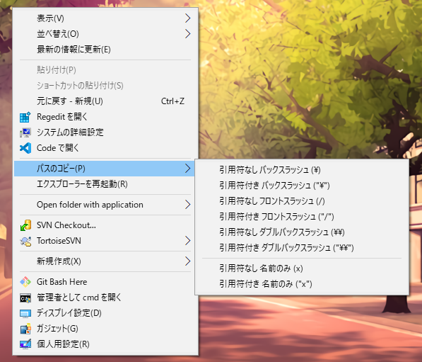
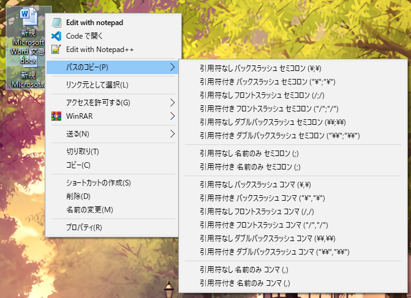

# CopyPathMenu

+ A Windows extension that is used to copy file(s)'s path through context menu (in Japanese).
+ Environment: `Windows 10 20H2 x64` `Visual Studio 2019` `msvc2019`

### Register

+ Open cmd as administrator, and you may need to restart explorer.exe.

```bash
Register.bat
# or execute the following commands

regsvr32 x64\Release\CopyPathMenu.dll
```

+ Setup registry for context menu (This process is not defined in rgs, you have to do it manually).
+ Note that CLSID is set in [CopyPathMenu.idl](./CopyPathMenu/CopyPathMenu.idl) and [CopyPathMenuImpl.rgs](./CopyPathMenu/CopyPathMenuImpl.rgs).

```reg
; Use Register.reg

[HKEY_CLASSES_ROOT\*\shellex\ContextMenuHandlers\CopyPathMenu]
@="{7a73e28f-7fd5-436e-bdc0-8f25fb8ede0f}"

[HKEY_CLASSES_ROOT\lnkfile\shellex\ContextMenuHandlers\CopyPathMenu]
@="{7a73e28f-7fd5-436e-bdc0-8f25fb8ede0f}"

[HKEY_CLASSES_ROOT\Directory\shellex\ContextMenuHandlers\CopyPathMenu]
@="{7a73e28f-7fd5-436e-bdc0-8f25fb8ede0f}"

[HKEY_CLASSES_ROOT\Directory\Background\shellex\ContextMenuHandlers\CopyPathMenu]
@="{7a73e28f-7fd5-436e-bdc0-8f25fb8ede0f}"
```

### Unregister

+ Open cmd as administrator.

```bash
Unregister.bat
# or execute the following commands

regsvr32 /u x64\Release\CopyPathMenu.dll
```

+ Remove context menu from registry.

```reg
; Use Unregister.reg

[-HKEY_CLASSES_ROOT\*\shellex\ContextMenuHandlers\CopyPathMenu]

[-HKEY_CLASSES_ROOT\lnkfile\shellex\ContextMenuHandlers\CopyPathMenu]

[-HKEY_CLASSES_ROOT\Directory\shellex\ContextMenuHandlers\CopyPathMenu]

[-HKEY_CLASSES_ROOT\Directory\Background\shellex\ContextMenuHandlers\CopyPathMenu]
```

### Screenshot

|||
|---|---|

### References

+ [Windows Shell编程实现右键菜单](https://blog.csdn.net/zaishaoyi/article/details/38475553)
+ [ショットカットメニュー ハンドラ](http://eternalwindows.jp/shell/shellex/shellex08.html)
+ [クリップボード](http://wisdom.sakura.ne.jp/system/winapi/win32/win90.html)
+ [Working with Strings](https://docs.microsoft.com/en-us/windows/win32/learnwin32/working-with-strings)
+ [Windows Shell Extension doesn't give exact file paths](https://stackoverflow.com/questions/21848694/windows-shell-extension-doesnt-give-exact-file-paths)
