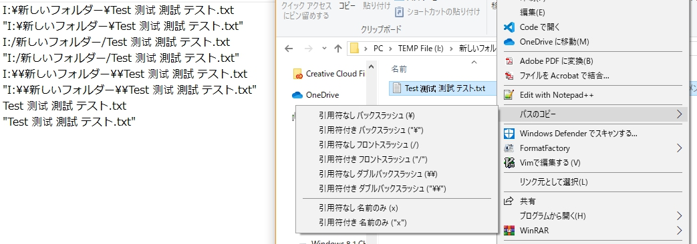
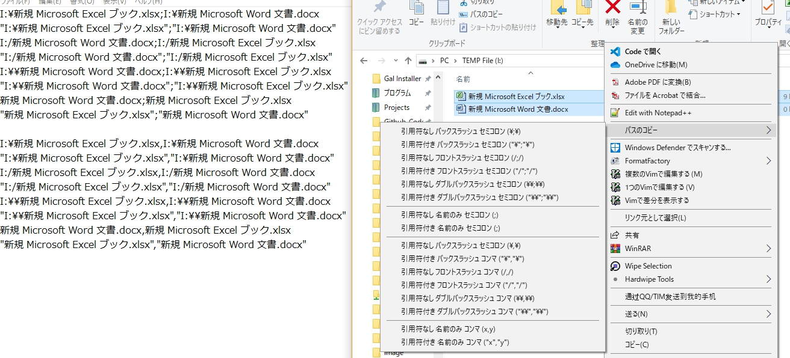

# CopyShell

+ An Windows shell extension, used to add some filepath copy actions to context menu.

### Environment

+ `MSVC 2019`
+ `Windows 10 1803 x64`

### Register

```bash
# Build x64 Register platform

cd x64/Release/
regsvr32 CopyShell.dll
Register.reg

# Unregister
regsvr32 /u CopyShell.dll
Unregister.reg
```

### Tips

+ Tutorial see [tutorial.md](./tutorial.md)
+ Main code see [CopyMenu.h](./CopyMenu.h) and [CopyMenu.cpp](./CopyMenu.cpp)
+ CLSID setting see [CopyShell.idl](./CopyShell.idl) and [CopyMenu.rgs](./CopyMenu.rgs)
+ Use `wstring` and `LPWSTR` rather than `string` and `LPSTR` to support other code page
+ `lnk` file `QueryContextMenu` should register twice (`*` and `.lnk`) to filter the exact paths

### Screenshot





### References

+ [Windows Shell编程实现右键菜单](https://blog.csdn.net/zaishaoyi/article/details/38475553)
+ [ショットカットメニュー ハンドラ](http://eternalwindows.jp/shell/shellex/shellex08.html)
+ [クリップボード](http://wisdom.sakura.ne.jp/system/winapi/win32/win90.html)
+ [Working with Strings](https://docs.microsoft.com/en-us/windows/win32/learnwin32/working-with-strings)
+ [Windows Shell Extension doesn't give exact file paths](https://stackoverflow.com/questions/21848694/windows-shell-extension-doesnt-give-exact-file-paths)
