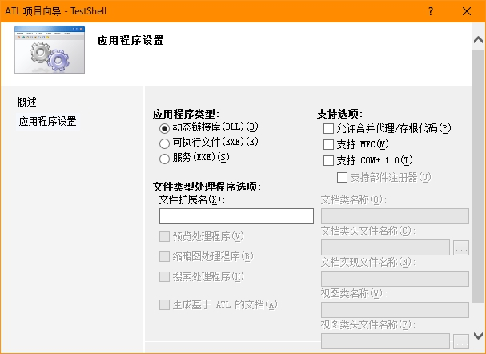
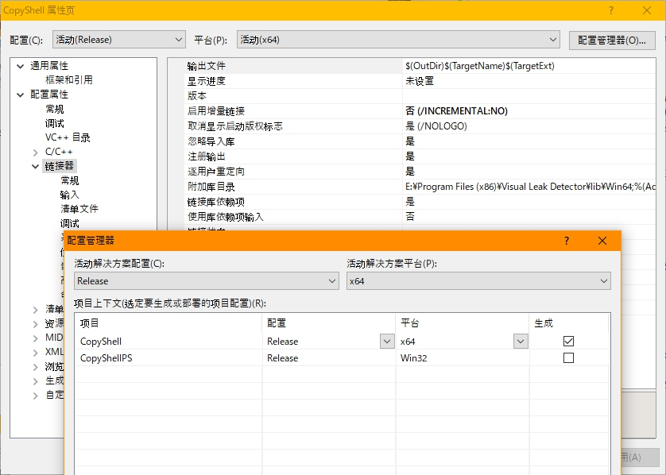
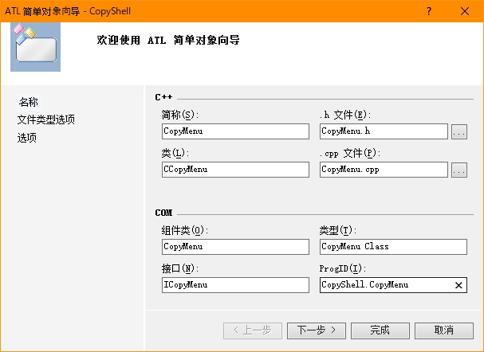

# 上下文菜单 Shell Extension (ATL)
> + 英文苦手
> + 算是把 ATL 老坑补了

### 建立接口
+ ATL 工程保持默认配置



+ 项目链接器属性修改为用户重定向，并且将主项目设置成 x64 平台



+ 新建 ATL 简单对象，生成对应头源文件和资源文件 



### 实现接口
+ 引入头文件

```c++
// stdafx.h

// ...

#include <shlobj.h>
#include <shobjidl.h>
```

+ 继承 `IShellExtInit` `IContextMenu`，宏 `COM_INTERFACE_ENTRY` 注册入口

```c++
// CopyMenu.cpp

class ATL_NO_VTABLE CCopyMenu :
	public CComObjectRootEx<CComSingleThreadModel>,
	public CComCoClass<CCopyMenu, &CLSID_CopyMenu>,
	public IDispatchImpl<ICopyMenu, &IID_ICopyMenu, &LIBID_CopyShellLib, /*wMajor =*/ 1, /*wMinor =*/ 0>,
	public IShellExtInit,
	public IContextMenu
{
public:
	CCopyMenu()
	{
	}

DECLARE_REGISTRY_RESOURCEID(IDR_COPYMENU)


BEGIN_COM_MAP(CCopyMenu)
	COM_INTERFACE_ENTRY(ICopyMenu)
	COM_INTERFACE_ENTRY(IDispatch)
	COM_INTERFACE_ENTRY(IShellExtInit)
	COM_INTERFACE_ENTRY(IContextMenu)
END_COM_MAP()

// ...

}
```

+ 重写类 `IShellExtInit` 的虚函数 `Initialize()`，具体函数签名参照各平台的接口源代码

```c++
// CopyMenu.h

public:

// 用户打开菜单时获取文件名
virtual HRESULT STDMETHODCALLTYPE Initialize( 
    /* [annotation][unique][in] */ 
    __in_opt  PCIDLIST_ABSOLUTE pidlFolder,
    /* [annotation][unique][in] */ 
    __in_opt  IDataObject *pdtobj,
    /* [annotation][unique][in] */ 
    __in_opt  HKEY hkeyProgID);
```

```c++
// CopyMenu.cpp

HRESULT STDMETHODCALLTYPE CCopyMenu::Initialize(
	__in_opt  PCIDLIST_ABSOLUTE pidlFolder,
	__in_opt  IDataObject *pdtobj,
	__in_opt  HKEY hkeyProgID)
{
    return S_OK;
}
```

+ 重写 `IContextMenu` 的虚函数 `QueryContextMenu()` `InvokeCommand()` `GetCommandString()`

```c++
// CopyMenu.h

// 创建菜单
virtual HRESULT STDMETHODCALLTYPE QueryContextMenu( 
    /* [annotation][in] */ 
    __in  HMENU hmenu,
    /* [annotation][in] */ 
    __in  UINT indexMenu,
    /* [annotation][in] */ 
    __in  UINT idCmdFirst,
    /* [annotation][in] */ 
    __in  UINT idCmdLast,
    /* [annotation][in] */ 
    __in  UINT uFlags);

// 菜单响应
virtual HRESULT STDMETHODCALLTYPE InvokeCommand( 
    /* [annotation][in] */ 
    __in  CMINVOKECOMMANDINFO *pici);

// 弹出提示
virtual HRESULT STDMETHODCALLTYPE GetCommandString( 
    /* [annotation][in] */ 
    __in  UINT_PTR idCmd,
    /* [annotation][in] */ 
    __in  UINT uType,
    /* [annotation][in] */ 
    __reserved  UINT *pReserved,
    /* [annotation][out] */ 
    __out_awcount(!(uType & GCS_UNICODE), cchMax)  LPSTR pszName,
    /* [annotation][in] */ 
    __in  UINT cchMax);
```

```c++
// CopyMenu.cpp

HRESULT STDMETHODCALLTYPE QueryContextMenu(
    __in  HMENU hmenu,
    __in  UINT indexMenu,
    __in  UINT idCmdFirst,
    __in  UINT idCmdLast,
    __in  UINT uFlags) 
{
    return S_OK;
}

HRESULT STDMETHODCALLTYPE InvokeCommand(
    __in  CMINVOKECOMMANDINFO *pici)
{
    return S_OK;
}

HRESULT STDMETHODCALLTYPE GetCommandString(
    __in  UINT_PTR idCmd,
    __in  UINT uType,
    __reserved  UINT *pReserved,
    __out_awcount(!(uType & GCS_UNICODE), cchMax)  LPSTR pszName,
    __in  UINT cchMax)
{
    return S_OK;
}
```

+ `QueryContextMenu()` 创建菜单

```c++
// CopyMenu.cpp

const UINT MENU_ID_1 = 0;

HRESULT STDMETHODCALLTYPE CCopyMenu::QueryContextMenu(
	__in  HMENU hmenu,
	__in  UINT indexMenu,
	__in  UINT idCmdFirst,
	__in  UINT idCmdLast,
	__in  UINT uFlags)
{
	if (uFlags & CMF_DEFAULTONLY)
		return MAKE_SCODE(SEVERITY_SUCCESS, FACILITY_NULL, 0);

	HMENU subMenu = CreateMenu();

	MENUITEMINFO outMenu;
	outMenu.cbSize = sizeof(MENUITEMINFO);
	outMenu.fMask = MIIM_STRING | MIIM_SUBMENU;
	outMenu.dwTypeData = _T("パスのコピー");
	outMenu.hSubMenu = subMenu;

	MENUITEMINFO cpy_menuItem;
	cpy_menuItem.cbSize = sizeof(MENUITEMINFO);
	cpy_menuItem.fMask = MIIM_STRING | MIIM_ID;
	cpy_menuItem.dwTypeData = _T("引用記号抜き");
	cpy_menuItem.wID = idCmdFirst + MENU_ID_1;

	InsertMenuItem(hmenu, indexMenu, true, &outMenu);
	InsertMenuItem(subMenu, 0, true, &cpy_menuItem);

	return MAKE_SCODE(SEVERITY_SUCCESS, FACILITY_NULL, 1); // 1 ID
}
```

+ `InvokeCommand` 实现菜单

```c++
// CopyMenu.cpp

HRESULT STDMETHODCALLTYPE CCopyMenu::InvokeCommand(
	__in  CMINVOKECOMMANDINFO *pici)
{
	UINT idCmd = LOWORD(pici->lpVerb);
	if (HIWORD(pici->lpVerb) != 0)
		return E_INVALIDARG;
        
	switch (idCmd) {
	case MENU_ID_1:
        MessageBox(NULL, _T("MENU_ID_1"), _T("Mhell"), MB_OK);
		break;
	}
	return S_OK;
}
```

+ `GetCommandString` 弹出提示

```c++
// CopyMenu.cpp

HRESULT STDMETHODCALLTYPE CCopyMenu::GetCommandString(
	__in  UINT_PTR idCmd,
	__in  UINT uType,
	__reserved  UINT *pReserved,
	__out_awcount(!(uType & GCS_UNICODE), cchMax)  LPSTR pszName,
	__in  UINT cchMax)
{
    // 不使用
	return S_OK;
}
```

+ `Initialize` 获取信息

```c++
// CopyMenu.cpp

#include <atlconv.h>
#include <string>
#include <vector>

HRESULT STDMETHODCALLTYPE CCopyMenu::Initialize(
	__in_opt  PCIDLIST_ABSOLUTE pidlFolder,
	__in_opt  IDataObject *pdtobj,
	__in_opt  HKEY hkeyProgID)
{
	HRESULT hr = E_INVALIDARG;
	
	FORMATETC fe = { CF_HDROP, NULL, DVASPECT_CONTENT, -1, TYMED_HGLOBAL };
	STGMEDIUM stm = {};
	if (SUCCEEDED(pdtobj->GetData(&fe, &stm))) {
		HDROP hDrop = static_cast<HDROP>(GlobalLock(stm.hGlobal));
		if (hDrop != NULL) {
			UINT cnt = DragQueryFile(hDrop, 0xFFFFFFFF, NULL, 0);
			if (cnt != 0) {
                std::vector<std::string> sel_files;
				for (UINT i = 0; i < cnt; i++) {
					LPWSTR str = new WCHAR[2048];
					memset(str, 0, 2048);
					int size = DragQueryFile(hDrop, i, str, 2048);
					if (size == 0) continue;
					std::string name = ATL::CW2A(str);
					delete []str;

					if (name == "") continue;
					sel_files.push_back(name);
				}
				hr = S_OK;
				GlobalUnlock(stm.hGlobal);
			}
			ReleaseStgMedium(&stm);
		}
	}
	return hr;
}
```

### 写入注册表

+ 查看 CLSID

```c++
// CopyShell.idl

library CopyShellLib
{
	importlib("stdole2.tlb");
	[
        // 需要与 CopyMenu.rgs 对应
		uuid(786C8A4B-9492-47C2-982D-74CECD921E74),
		helpstring("ComponentRegister Class")
	]
	coclass CopyMenu
	{
		[default] interface ICopyMenu;
	};
};
```

```c++
// CopyMenu.rgs
CopyShell.CopyMenu.1 = s 'CopyMenu Class'
{
    CLSID = s '{786C8A4B-9492-47C2-982D-74CECD921E74}'
}
```

+ 注册 dll

```bash
# x86 Release 编译

regsvr32 CopyShell.dll
# regsvr32 /u CopyShell.dll

# 在注册表 コンピューター\HKEY_CLASSES_ROOT\CLSID 查看
```


+ 创建菜单

```reg
Windows Registry Editor Version 5.00

; CLSID
[HKEY_CLASSES_ROOT\*\shellex\ContextMenuHandlers\CopyShell]
@="{786C8A4B-9492-47C2-982D-74CECD921E74}"

```